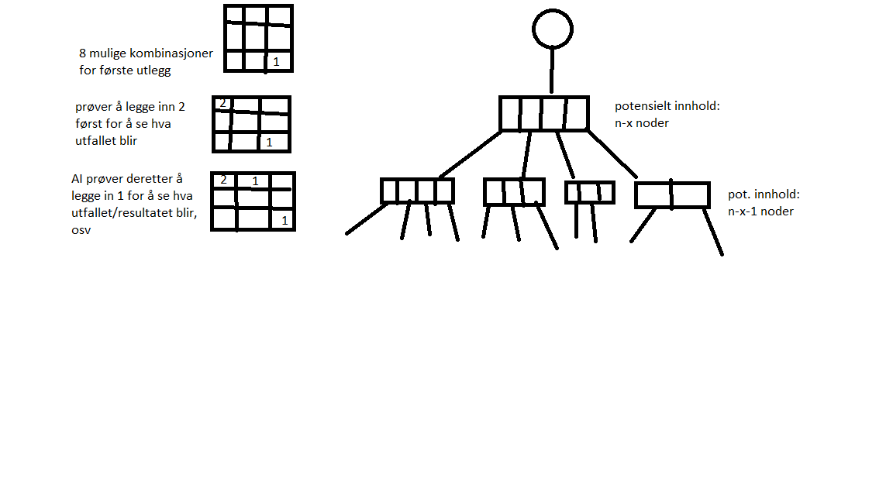

#Rapport for oblig 2

Dette er en rapport for oblig 2 i c++ faget. Hensikten med rapporten er å forklare programstrukturen som vi ble bedt om å implementere til obligen på best mulig måte. Under ligger en oversikt over nøyaktig
hva koden gjør, samt en detaljert beskrivelse av klassene. Jeg har også lagt inn kommentarer i selve koden som forklarer litt mer i detaljer de valgene jeg har gjort.

##Programmet i sin helhet

Programmet i sin helhet går ut på at det spilles nxn på rad med en spiller mot datamaskin eller datamaskin mot datamaskin. Algoritmen som utgjør datamaskinen er utformet slik at det er umulig å slå den, det beste resultatet man kan få er uavgjort.
I likhet med sjakk, er 3 på rad et spill der det i prinsippet er mulig å evaluere og forutse alle mulige trekk som finnes. Det faktum at det er mulig, tilsier derfor at man bare kan ende opp som uavgjort
dersom to spillere spiller for å vinne og gjør det uten noen feil (ved å gjøre trekk som gjør at man vinner og ved å ikke gjør trekk som uungåelig fører til at man taper gitt at motstanderen spiller perfekt).   

Algoritmen som er brukt i programmet  er basert på dette prinsippet, og dette gjør at det ikke vil være mulig å slå den. Ulempen er at dette krever en del datakraft. Uten optimaliseringene
som er gjort, vil antall mulige kombinasjoner som AIen må prosessere være (n*n)!. Dette er feks 9! for 3 på rad.

Jeg har i denne oppgaven valgt å bruke så få klasser som mulig, for å gjøre programstrukturen mer effektiv. Ulempen med objektorientering er at det ofte involverer flere funksjonskall. Dersom et funksjonkall er betinget (conditional branch),
kan dette ha en signifikant innvirkning på ytelsen til programmet (fordii prosessoren ikke vet hvor en branch fører hen før if-setningen er ute av pipeline). Hvordan prosessoren håndterer dette er arkitekturavhengig, men
det fører nesten alltid til "stalling" i en viss periode (se. http://en.wikipedia.org/wiki/Branch_predictor). Dette var også med tanke på at programmet i utgangspunktet var tenkt å bruke multithreading. Jeg vil allikevel påpeke
at skrive og leseopperasjonene til cache og muligens ram er den mest signifikante i algoritmen. (Jeg antar alle data på automatic store har WB bitet i PAT satt, og på free store WT-bitet. Dette gir best preformance generelt for disse i x86. se IA-32-e software and developer manual s.542 "Methods of caching")

Tanken bak algoritmen for AI er basert på mini-max prinsippet (se kilder). Jeg har imidlertidig gjort såpass mange tilpasninger og forandringer/forbedringer slik at algoritmen ikke kan kalles
en minimax algoritme (algoritmen gjør ingen søk i nodene ved sortering, og bruker ikke nødvendigvis min og max verdier) . Algoritmen i seg selv har jeg utviklet helt på egen hånd nøyaktig for denne obligen gjennom ressoneringen som er beskrevet høyere opp. 
Dette betyr også at cpu ikke bruker noen klassiske "strategier" i denne implementasjonen.

##Systemkrav/recommanded specs

minimum intel i7 2700k eller intel i7 2630QM ekvivalent eller høyere for 9x9 brett.
DDR3-1333mhz (latency: 8-8-8-24 eller lavere)

##nRadAction-klassen

Tanken med nRadActionklassen er at den skal håndtere alt som har med brukeren å gjøre. En mainmetode starter spillet ved å kalle game-funksjonen. I gamefunksjonen blir spilleren bedt om å oppgi
lengde på spillet og dersom man ønsker å se ai vs ai. Derretter slås det om hvem som starter gjennom en randomfunksjon. Når det er spilleren sin tur, vil en input fra bruker hentes fra
getAction-metoden. Brukeren handling vil derretter behandles i takeAction metoden som eventuelt vil legge brikken inn i spillet. Når det er Aiens tur vil et nRad objekt opprettes og metoden calculate blir kalt.

##node-klassen

Nodeklassen er laget for å inneholde et array med sin egen type. Dette gjør at man kan organisere nodene i en trestruktur (se diagram). Jeg har for enkelhets skyld valgt å ikke legge og ta ut noder i selve nodeklassen.
nodeklassen inneholder også en verdi på en node, og hvilken rad og kolonne denne verdien tilhører.

##nRad-klassen

I nRad så ligger alt som har med spillet generelt å gjøre. Metodene end,tie og win sjekker om spillet slutter, er uavgjort eller om en av spillerne har vunnet (basert på input). Metoden calculate
finner det mest lønnsomme trekket blant nodene som AIen kan gjøre basert på spillets tilstand. Den bruker informasjonen fra noden og legger den tilsvarende brikken noden representerer inn i spillet.
Metoden calculateAction prøver alle mulige kombinasjoner og velger samtidig ut det beste trekket basert på spillets tilstand. Algoritmen består både i å beregne hvilket trekk aien skal gjøre,
samtidig som at den også skal beregne hvilket trekk spilleren kommer til gjøre som respons for AIens trekk.Dette gjøres rekursivt. (dersom ikke lenken til diagrammet funker, så åpne heller diagrammet manuelt)

##Følgende opptimaliseringer er også gjort:

Dersom lengden av spillet er større enn 3, begynner antall noder å bli så høyt at maskinen får problemer. Derfor er det lagt inn en maximal dybde som algoritmen søker etter. Ettersom det maximalt tar 2
trekk for å vinne (uavhengig av spillets størrelse) kan jeg derfor anta at en handling fører til uavgjort dersom trekket ikke fører til at noen vinner eller taper innen 2 trekk. Derfor er maksimal dybde satt til 
2 trekk.

Den andre signifikante optimaliseringen er at algoritmen ikke alltid returnerer det beste trekket for 4x4 og høyere. Dette fører til langt færre noder som må opprettes. Fordi som jeg tidligere nevnte så kan ikke noen av spillerne vinne dersom begge spiller perfekt.
Dette betyr også at den ene spilleren bare trenger å spille trekk som fører til at spillet ender uavgjort. Dette er som sagt igjen fordi at den andre spilleren som prøver å vinne, ville 
aldri velge et trekk som fører til at han taper. Dette fører jo igjen til at den ene spilleren derfor aldri vil få muligheten til å gjøre et trekk som fører til at den andre spilleren vinner.
Ergo så vil den andre spilleren kun få velge mellom trekk der det blir uavgjort eller der han taper. Dette tilsvarer en return setning dersom verdien på noden =2.

Legg merke til at dette kan kun gjøres på den ene spilleren.
Dersom det gjøres på begge spillere (i ai delen for calculateAction), vil plasseringen av trekk bli tilfeldig fordi ingen av spillerne legger ut på bakgrunn av at de er interessert i å vinne. Algoritmen vil dermed isåfall ikke kunne se de trekkene
som fører til at en spiller faktisk vinner (og heller tro at det trekket fører til uavgjort).

##problemer

Jeg hadde en del problemer med plattform avhengighet, spesielt i forhold til multithreading/paralellisering. Den opprinnelige tanken var å paralellisere aien for å utnytte prosessoren maximalt.
Fordi systemkallene er såpass forskjellige på windows og linux så var det nesten umulig å få til dette på en fornuftig måte. Jeg har også hatt problemer med nettet på skolen(jeg kommer ikke inn) og jeg velger derfor å bruke windows som utviklermiljø.
Det finnes et bibliotek som heter pthread, men måten man bruker trådene der var ganske upassende for mitt behov (første instruksjon til tråden er funksjonskallet til en funksjon som returnerer en voidpeker).

Jeg valgte også å ikke skrive inn plasseriner av brikkene på kordinatform. Fordi jeg har spesifisert at algoritmen kan potensielt ta uendelig lengde, så kan vi ikke vite hvilken plass kommaet ligger på i kordinatene.
Løsningen ville isåfall vært å lete gjennom const char arrayet helt til man finner kommaet og gange ut hvert enkelt decimal før og etter det med de respektive plassene i 10-tallsystemet ("99"=9*1+9*10= en integer).
Jeg valgte også for enkelhets skyld å vise brikkene som: 0,1,2 der 0 er et tomt felt.
Jeg er heller ikke sikker på om make-en jeg har laget faktisk fungerer ssh sin versjon av linux (make er også veldig plattformavhengig). Dersom den ikke virker på gjeldene plattform, så kjør følgende:

På grunn av platformavhengighet har jeg også valgt å ikke implementere kravet om å gjennomføre trekkene i ai vs ai i sakte film. Koden som gjør dette har jeg lagt inn som kommentar(sleep). Biblioteket
som kreves for å gjennomføre det er imidlertidig med, men er ubrukelig i mingw kompilatoren.

##forbedringer

Som tidligere nevnt, er multithreading en forbedring som kan forbedre ytelsen opptil 8 ganger (gitt systemkrav). Det er lagt inn noen få kommentar på ting som isåfall ville vært lagt inn.
Men det er en god del mer innhold som må legges til. Det er også i forhold til ytelsen, iallefall ett sted i koden(calculateAction) der jeg burde ha splittet koden opp i 2 funksjoner for effektiviteten. Koden kunne også kanskje vært litt
mer tilpasset for å legge til eller fjerne ting senere (flere funksjoner). Det går selvfølgelig også an å argumenterer for et mer objektorientert design enkelte steder for å få til dette. Jeg vil heller påpeke
at fokuset i denne oppgaven lå mer i å lage selve algoritmen for datamaskinen og lete etter biblioteker som både passer til mitt bruk, er standard og fungerer på alle platformer.

##referanser
Jeg refererer til dokumentasjon for alle standardbibliotekene som er brukt i obligen i tillegg til det som står under.
equillibrium: http://en.wikipedia.org/wiki/Nash_equilibrium
minimax: http://en.wikipedia.org/wiki/Minimax
pthread:https://computing.llnl.gov/tutorials/pthreads/

